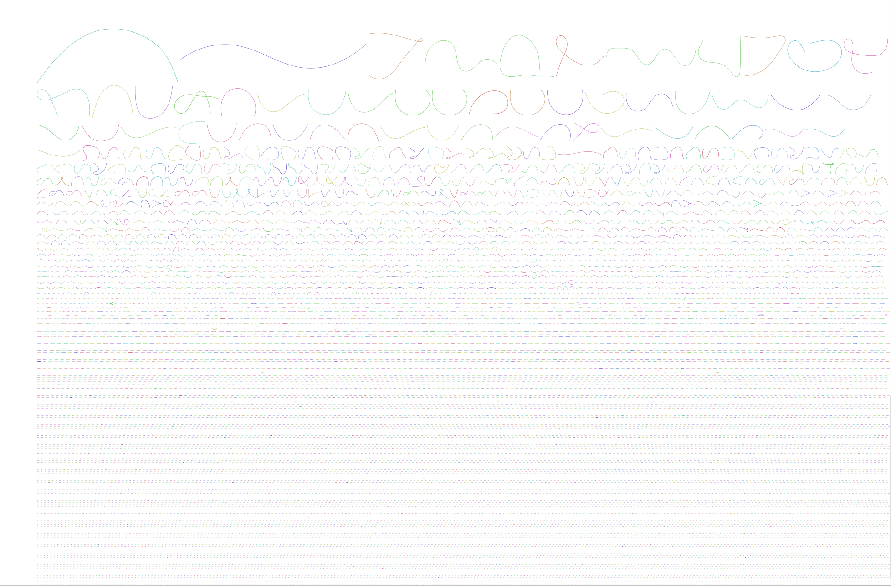

#what i learnt today

testing to sync   

# MARKDOWN DAY ONE GUIDE
  
## Commands
+ help
+ touch
+ sl
+ cp
+ mk
+ sbatch
+ pwd
+ module avail
+ ssh -X : ssh -X sunam230@caucluster.rz.uni-kiel.de
+ $WORK
+ cd
+ micromamba env list

`logging into sunam account for the cluster and the micromamba environment that is appropriate is crucial.`

  # DAY 2 GUIDE
  ## 1. Quality control of raw reads
  run `fastqc` on several files named `*.fastq.gz`, which are compressed (zipped) sequencing reads files. 
  > `fastqc file.fastq.gz` : run `fastq` on `file.fastq.gz`  
  > `-o` : output folder  
   
   fastp allows you to process and filter the reads.
> `-i R1.fastq.gz` : input forward reads  
> `-I R2.fastq.gz` : input reverse reads  
> `-o output_folder/R1.fastq.gz` : output processed forward reads  
> `-O output_folder/R2.fastq.gz` : output processed reverse reads  
> `-t 6` : how many bases to trim from the tail of the forward reads  
> `-q 20` : Phred score threshold for filtering bases  
> `-h sample1.html` : name of the HTML-format report file  
> `-R "Sample 1"` : title for the output report file  
## 2. Assembly

Once the reads are filtered and cleaned by `fastp`, you can perform genome assemblies using `megahit`
> `-1` : input forward reads  
> `-2` : input reverse reads  
> `-o` : output directory  

To visualize the assembled contigs in `Bandage`, you need to convert the plain-text sequence file (`fasta`) into a fasta-like graph (`fastg`). To create a graph.
open `final.contigs.fastg` in `Bandage`. Once it is loaded (which might take a moment), click on `Draw graph` to visualize the contigs in the assembly.